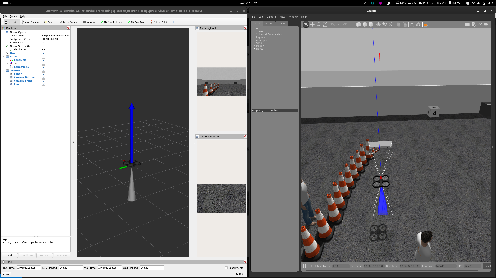
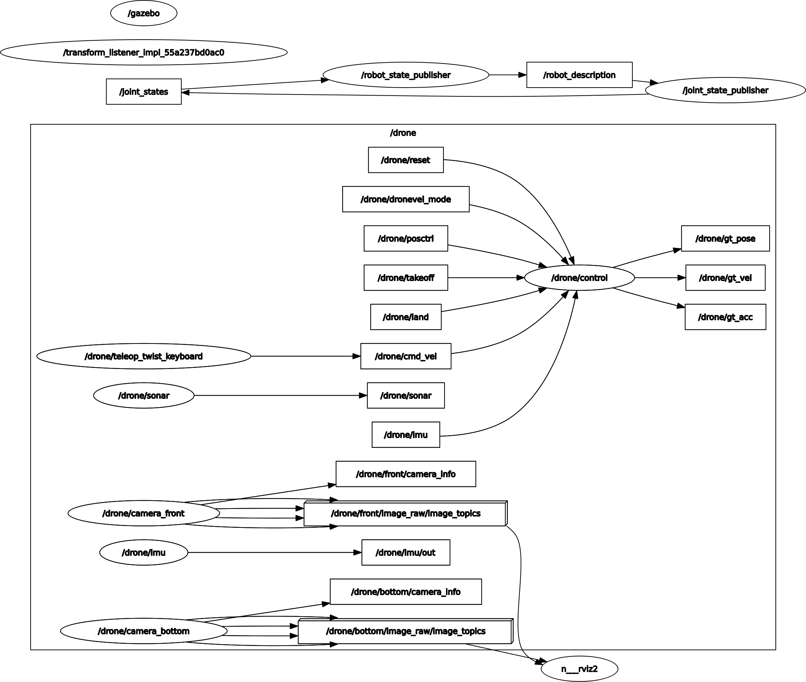

# sjtu_drone

[](https://github.com/NovoG93/sjtu_drone/actions/workflows/CI_CD.yml) [](https://github.com/NovoG93/sjtu_drone/actions/workflows/CI_CD.yml) [](https://github.com/NovoG93/sjtu_drone/actions/workflows/CI_CD.yml)

sjtu_drone is a quadrotor simulation program forked from [tum_simulator](http://wiki.ros.org/tum_simulator), developed using ROS + Gazebo.

The acronym 'sjtu' stands for Shanghai Jiao Tong University. This package has been used in the past for testing algorithms for the [UAV contest at SJTU](http://mediasoc.sjtu.edu.cn/wordpress)

# Requirements

This package is tested with ROS 2 (Ubuntu 22.04) and Gazebo 11.

# Downloading and building

```
cd ~/git && git clone git@github.com:NovoG93/sjtu_drone.git -b ros2
cd ~/ros2_ws/src && ln -s ~/git/sjtu_drone
cd .. && rosdep install -r -y --from-paths src --ignore-src --rosdistro $ROS_DISTRO && colcon build --packages-select-regex sjtu*
```

To use the playground.world file (as depicted below) make sure to install the common gazebo models, for more see the [Readme in sjtu_drone_description](./sjtu_drone_description/README.md).

## Drone Topics

### Sensors
The folowing sensors are currently implemented:
- ~/front_camera/image_raw [__sensor_msgs/msg/Image__]
- ~/bottom/image_raw [__sensor_msgs/msg/Image__]
- ~/sonar [__sensor_msgs/msg/Range__]
- ~/imu [__sensor_msgs/msg/Imu__]


### Control 
The following control topics are currently subscribed to:
- ~/cmd_vel [__geometry_msgs/msg/Twist__]: Steers the drone
- ~/land [__std_msgs/msg/Empty__]: Lands the drone
- ~/takeoff [__std_msgs/msg/Empty__]: Starts the drone
- ~/posctrl [__std_msgs/msg/Bool__]: Switch to position control
- ~/dronevel_mode [__std_msgs/msg/Bool__]: Change the drone steering method
- ~/reset [__std_msgs/msg/Empty__]: Resets the drone

### Ground Truth
The following ground truth topics are currently published:
- ~/gt_acc [__geometry_msgs/msg/Twist__]: ground truth acceleration
- ~/gt_pose [__geometry_msgs/msg/Pose__]: ground truth pose
- ~/gt_vel [__geometry_msgs/msg/Twist__]: ground truth velocity


# Run

## Docker

1. Start the docker container:   
`bash run_docker.sh`
2. Connect to docker container to takeoff / land drone:   
    1. `docker container exec -it sjtu_drone 'ros2 topic pub /drone/takeoff std_msgs/msg/Empty {} --once'`
    1. `docker container exec -it sjtu_drone 'ros2 topic pub /drone/land std_msgs/msg/Empty {} --once'`

## ROS 2 Source Installation

1. Start gazebo, spawn drone, open teleop in xterm window, and open rviz:   
`ros2 launch  sjtu_drone_bringup sjtu_drone_bringup.launch.py`
2. Takeoff drone:   
`ros2 topic pub /drone/takeoff std_msgs/msg/Empty {} --once`
3. Move drone: (use teleop window)
4. Land drone:   
`ros2 topic pub /drone/land std_msgs/msg/Empty {} --once`

You should see the following:



For more see the following image:



# PID Params

The parameters of the PID controller that controls the drone and the motion noise can be changed by adapting the file [sjtu_drone.urdf.xacro](sjtu_drone_description/urdf/sjtu_drone.urdf.xacro#L51-L80):

```xml
<plugin name='simple_drone' filename='libplugin_drone.so'>
    <bodyName>base_link</bodyName>
    <rosNamespace>drone</rosNamespace>
    <imuTopic>imu</imuTopic>
    <rollpitchProportionalGain>10.0</rollpitchProportionalGain>
    <rollpitchDifferentialGain>5.0</rollpitchDifferentialGain>
    <rollpitchLimit>0.5</rollpitchLimit>
    <yawProportionalGain>2.0</yawProportionalGain>
    <yawDifferentialGain>1.0</yawDifferentialGain>
    <yawLimit>1.5</yawLimit>
    <velocityXYProportionalGain>5.0</velocityXYProportionalGain>
    <velocityXYDifferentialGain>2.3</velocityXYDifferentialGain>
    <velocityXYLimit>2</velocityXYLimit>
    <velocityZProportionalGain>5.0</velocityZProportionalGain>
    <velocityZIntegralGain>0.0</velocityZIntegralGain>
    <velocityZDifferentialGain>1.0</velocityZDifferentialGain>
    <velocityZLimit>-1</velocityZLimit>
    <positionXYProportionalGain>1.1</positionXYProportionalGain>
    <positionXYDifferentialGain>0.0</positionXYDifferentialGain>
    <positionXYIntegralGain>0.0</positionXYIntegralGain>
    <positionXYLimit>5</positionXYLimit>
    <positionZProportionalGain>1.0</positionZProportionalGain>
    <positionZDifferentialGain>0.2</positionZDifferentialGain>
    <positionZIntegralGain>0.0</positionZIntegralGain>
    <positionZLimit>-1</positionZLimit>
    <maxForce>30</maxForce>
    <motionSmallNoise>0.05</motionSmallNoise>
    <motionDriftNoise>0.03</motionDriftNoise>
    <motionDriftNoiseTime>5.0</motionDriftNoiseTime>
</plugin>
```

# Known Issues
* No ROS communication between docker container and host
* Change of ROS namespace not working automatically for plugin_drone when changed in [spawn_drone.py](./sjtu_drone_bringup/sjtu_drone_bringup/spawn_drone.py)
    * TODO: Change to gazebo_ros::Node::SharedPtr